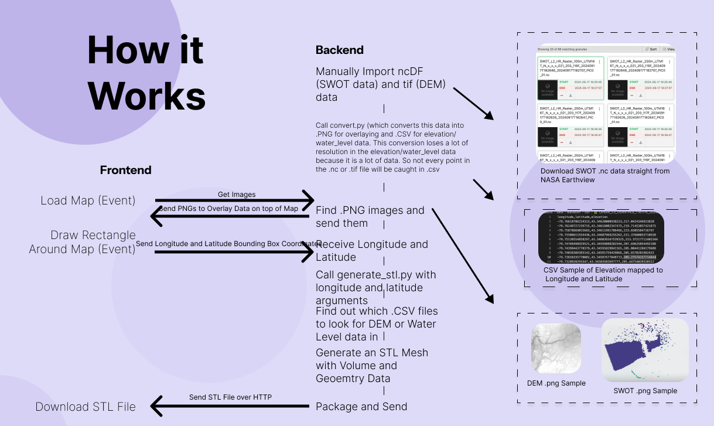
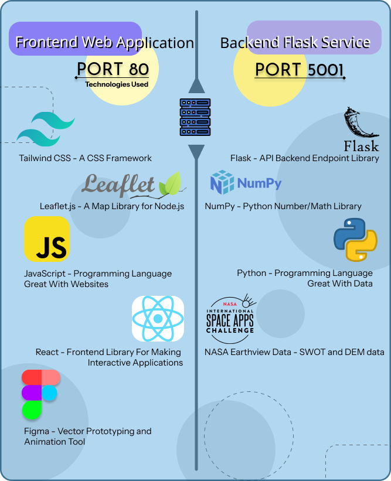
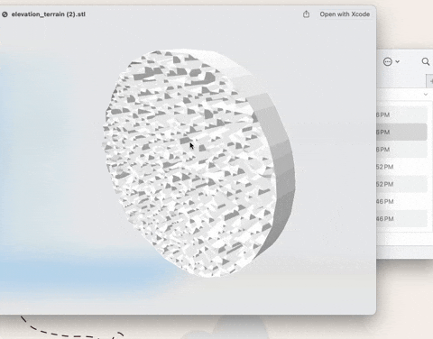
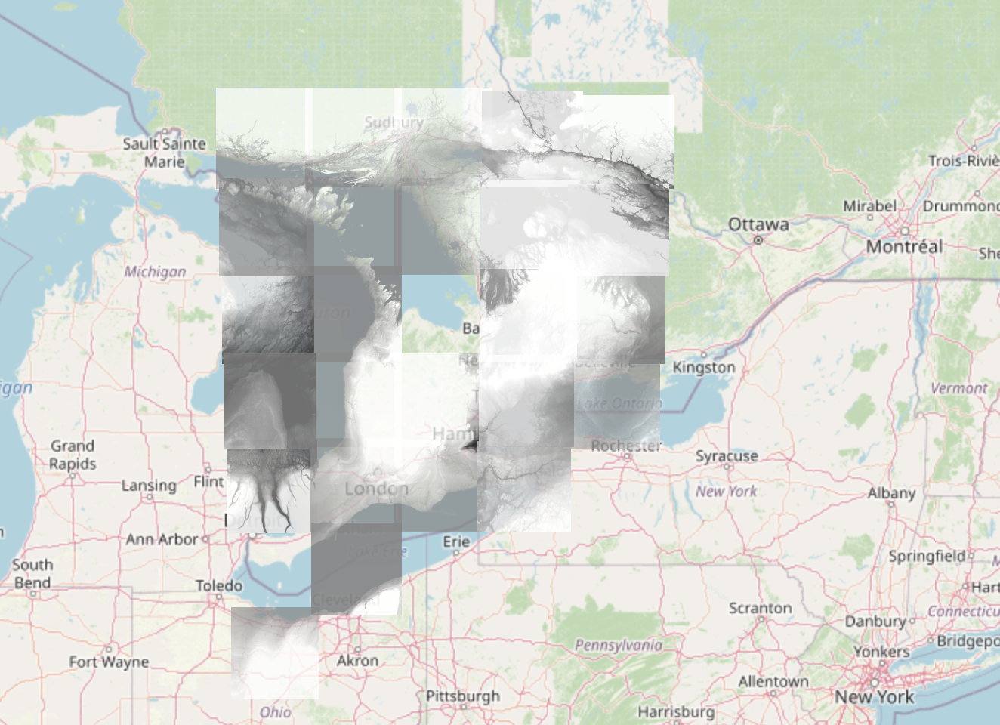
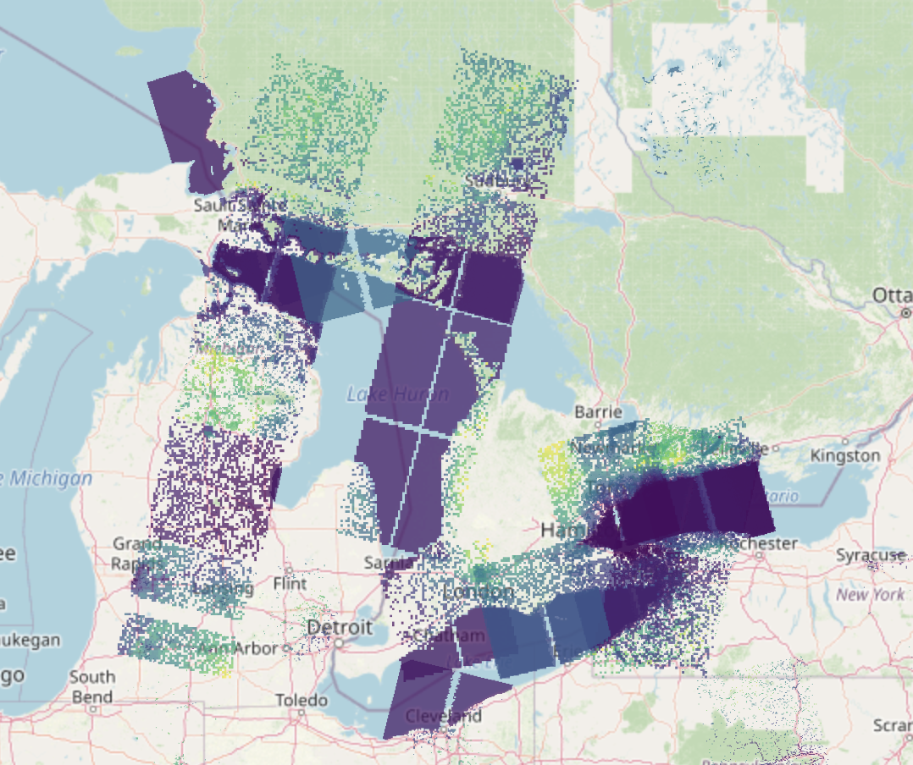
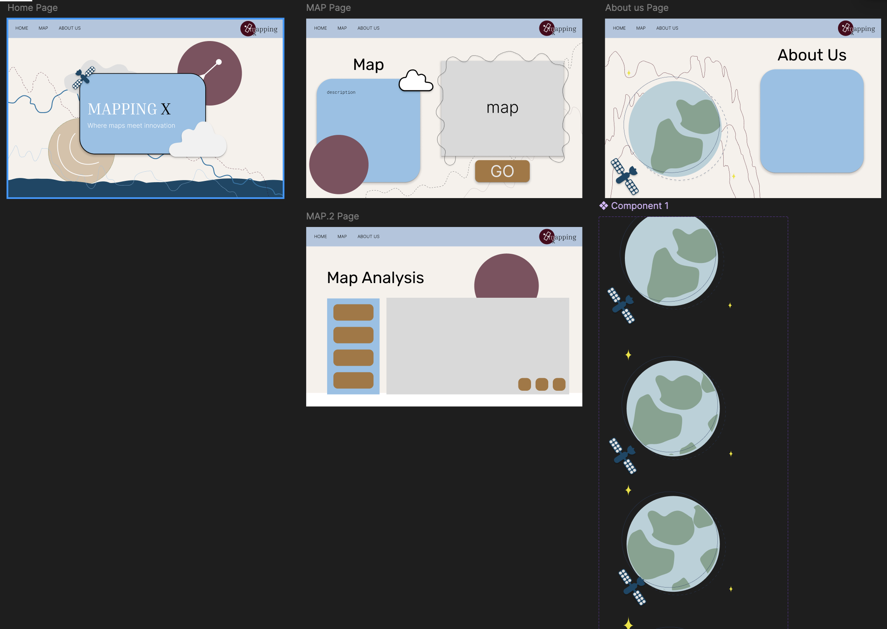

# nasa_space_apps_2024

## Overview

Mapping X is a web-based interactive Geographical Information System (GIS) tool that lets you generate .STL. meshes from Digital Elevation Model (DEM) data and Surface Water and Ocean Topography (SWOT) data from open-source NASA Earthview data. The generated STL meshes can be used for 3D printing for observation which can be used for terrain and water elevation analysis.

## Links

- Long form video (5 minutes) - <https://www.youtube.com/watch?v=ficv-n9h3qk>
- Short form video (30 seconds) - <https://www.youtube.com/watch?v=AShcmuF7qmU>
- Live Project Demo - <http://159.203.60.247/>
- GitHub Repository - <https://github.com/JeremyTubongbanua/nasa_space_apps_2024/>

## How It Works

1. We have to manually import ncDF (SWOT) and .tif (DEM) files into the backend/data/ folder. Then, each of the sub folders (swot and dem) have their own `convert.py` script that converts the ncDF and .tif files into .csv and .png files for each file. Lots of resolution is lost in this process because there are just too many coordinates (longitude, latitude). The .csv and .png files are then stored in the backend/data/ folder, where the .csv file has columns longitude, latitude, and elevation, and the .png file is a representation that can be overlayed on the map.
2. Now that we've converted our data appropriately, we can serve the frontend whena  request is made when a rectangular bounding box is drawn on the map. The frontend sends a request where the backend will receive thelongitude and latitude of the bounding box, and determine which .CSVs are needed to generate the .STL file. Then we simply generate a .STL file from the elvation data from the .CSVs with geometry and volume using numpy and send that back to the frontend.

Check out key components such as:

- [SWOT convert.py](./backend/data/swot/convert.py)
- [DEM convert.py](./backend/data/dem/convert.py)

## Tech Used

Not mentioned is Canva for video editing and Audacity for audio editing.

## Samples

Some random samples

DEM overlay

SWOT overlay

FIGMA prototyping

High Level overview of how it works

SWOT of Lake Huron

SWOT of Lake Ontario

Application (why is it useful)

Future improvements

